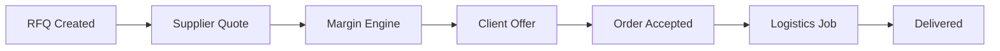

# 🚛 Faasen Trading - B2B Supply Chain Brokerage Platform

<div align="center">


**A full-stack B2B supply chain brokerage platform built with modern cloud technologies**

[Live Demo](https://faasentrading.vercel.app) · [Architecture](#architecture) · [Features](#features) · [Tech Stack](#tech-stack)

</div>

---

## 📋 Overview

Faasen Trading is a **blind brokerage platform** connecting buyers, suppliers, and transporters in the South African supply chain industry. The platform acts as an intermediary, ensuring confidentiality between parties while facilitating seamless procurement and logistics.

### 🎯 Business Model

```
Buyer ←→ Faasen Trading ←→ Supplier
                ↕
           Transporter
```

- **Buyers** never see supplier details
- **Suppliers** never see buyer details  
- **Faasen Trading** earns margin on the spread
- **Transporters** handle logistics independently

---

## ✨ Features

### 🔐 Role-Based Access Control (RBAC)
- **4 distinct user roles** with isolated dashboards
- **Row Level Security (RLS)** enforced at database level
- Secure data isolation between parties

### 📊 Multi-Role Dashboards

| Role | Capabilities |
|------|-------------|
| **Admin** | Manage users, create client offers, oversee all operations |
| **Buyer** | Submit RFQs, view/accept offers, track orders |
| **Supplier** | List products, submit quotes, manage catalog |
| **Transporter** | Browse available jobs, accept deliveries, update status |

### 💰 Dynamic Pricing Engine
- Configurable margin percentages per deal
- Automated logistics cost calculation
- VAT handling (15% SA standard)
- Minimum transport fee support

### 🗺️ Location-Based Logistics
- Pre-calculated city distances across South Africa
- Dynamic routing and cost estimation
- Real-time delivery tracking

### 🔄 Complete Deal Lifecycle



---

## 🏗️ Architecture

### System Design

```
┌─────────────────────────────────────────────────────────────┐
│                         FRONTEND                             │
│  ┌─────────────┐  ┌─────────────┐  ┌─────────────────────┐ │
│  │   Next.js   │  │  Tailwind   │  │     Shadcn/UI       │ │
│  │  App Router │  │     CSS     │  │    Components       │ │
│  └─────────────┘  └─────────────┘  └─────────────────────┘ │
└─────────────────────────────────────────────────────────────┘
                              │
                              ▼
┌─────────────────────────────────────────────────────────────┐
│                        SUPABASE                              │
│  ┌─────────────┐  ┌─────────────┐  ┌─────────────────────┐ │
│  │  PostgreSQL │  │    Auth     │  │   Edge Functions    │ │
│  │   + RLS     │  │   (GoTrue)  │  │  (Margin Engine)    │ │
│  └─────────────┘  └─────────────┘  └─────────────────────┘ │
└─────────────────────────────────────────────────────────────┘
                              │
                              ▼
┌─────────────────────────────────────────────────────────────┐
│                       DEPLOYMENT                             │
│  ┌─────────────┐  ┌─────────────┐  ┌─────────────────────┐ │
│  │   Vercel    │  │   GitHub    │  │      CI/CD          │ │
│  │   Hosting   │  │   Actions   │  │    (Auto Deploy)    │ │
│  └─────────────┘  └─────────────┘  └─────────────────────┘ │
└─────────────────────────────────────────────────────────────┘
```

### Database Schema

Key entities and relationships:

- `profiles` - User accounts with role-based permissions
- `rfqs` - Request for Quotations from buyers
- `supplier_quotes` - Quotes submitted by suppliers
- `client_offers` - Final offers sent to buyers (with margin applied)
- `orders` - Confirmed transactions
- `logistics_jobs` - Delivery assignments for transporters
- `supplier_products` - Product catalog from suppliers

---

## 🛠️ Tech Stack

### Frontend
- **Next.js 14** - React framework with App Router
- **TypeScript** - Type-safe development
- **Tailwind CSS** - Utility-first styling
- **Shadcn/UI** - Accessible component library
- **Lucide React** - Beautiful icons

### Backend
- **Supabase** - Backend-as-a-Service
  - PostgreSQL database
  - Row Level Security (RLS)
  - Authentication (email/password)
  - Edge Functions (Deno runtime)

### Cloud & DevOps
- **Vercel** - Serverless hosting & CDN
- **GitHub** - Version control & CI/CD trigger
- **Supabase Cloud** - Managed database infrastructure

---

## 🚀 Getting Started

### Prerequisites

- Node.js 18+
- npm or yarn
- Supabase account
- Vercel account (for deployment)

### Local Development

1. **Clone the repository**
   ```bash
   git clone https://github.com/yourusername/faasentrading.git
   cd faasentrading
   ```

2. **Install dependencies**
   ```bash
   npm install
   ```

3. **Set up environment variables**
   ```bash
   cp env.example .env.local
   ```
   
   Fill in your Supabase credentials:
   ```env
   NEXT_PUBLIC_SUPABASE_URL=your_supabase_url
   NEXT_PUBLIC_SUPABASE_ANON_KEY=your_anon_key
   ```

4. **Run database migrations**
   
   Apply the SQL migration in `supabase/migrations/00001_initial_schema.sql` to your Supabase project.

5. **Start the development server**
   ```bash
   npm run dev
   ```

6. **Open http://localhost:3000**

---

## 🧪 Demo Mode

The application includes a **Demo Mode** feature that allows you to switch between all four user roles without creating multiple accounts:

1. Register/Login with any account
2. Use the **Demo Mode** panel in the sidebar
3. Switch between: Admin, Buyer, Supplier, Transporter
4. Experience each role's unique dashboard and capabilities

---

## 📁 Project Structure

```
├── src/
│   ├── app/
│   │   ├── (auth)/          # Authentication pages
│   │   │   ├── login/
│   │   │   └── register/
│   │   ├── (dashboard)/     # Protected dashboard routes
│   │   │   ├── admin/       # Admin-specific pages
│   │   │   ├── dashboard/   # Main dashboard
│   │   │   ├── jobs/        # Transporter jobs
│   │   │   ├── my-jobs/     # Assigned jobs
│   │   │   ├── orders/      # Buyer orders
│   │   │   ├── products/    # Supplier products
│   │   │   ├── quotes/      # Quote management
│   │   │   ├── rfqs/        # RFQ management
│   │   │   └── settings/    # User settings
│   │   ├── globals.css
│   │   └── layout.tsx
│   ├── components/ui/       # Shadcn UI components
│   └── lib/
│       ├── supabase/        # Supabase client configs
│       └── utils.ts
├── supabase/
│   ├── functions/           # Edge Functions
│   │   └── calculate-client-offer/
│   └── migrations/          # SQL migrations
├── public/
├── env.example
└── README.md
```

---

## 🔒 Security Features

### Row Level Security (RLS)
Every table has RLS policies ensuring:
- Users only see data they're authorized to access
- Buyers cannot access supplier information
- Suppliers cannot access buyer information
- Transporters only see assigned jobs

### Authentication
- Secure email/password authentication via Supabase Auth
- Protected API routes
- Session management with automatic refresh

---

## 📈 Key Technical Achievements

1. **Multi-tenant Architecture** - Single codebase serving 4 distinct user types
2. **Database-level Security** - RLS policies prevent data leaks
3. **Serverless Functions** - Margin calculation as Edge Function
4. **Responsive Design** - Full mobile support
5. **Real-time Updates** - Supabase real-time subscriptions ready
6. **Type Safety** - Full TypeScript coverage

---

## 🌍 Deployment

### Deploy to Vercel

[](https://vercel.com/new/clone?repository-url=https://github.com/yourusername/faasentrading)

1. Click the button above or import from GitHub
2. Add environment variables:
   - `NEXT_PUBLIC_SUPABASE_URL`
   - `NEXT_PUBLIC_SUPABASE_ANON_KEY`
3. Deploy!

### Manual Deployment

```bash
npm run build
vercel --prod
```

---

## 📄 License

This project is licensed under the MIT License - see the [LICENSE](LICENSE) file for details.

---

## 👨‍💻 Author

**Your Name**

- LinkedIn: [Your LinkedIn](https://linkedin.com/in/yourprofile)
- GitHub: [@yourusername](https://github.com/yourusername)

---

<div align="center">

**Built with ❤️ for the Cloud Engineering Capstone Project**

*Demonstrating full-stack development, cloud architecture, and DevOps practices*

</div>
